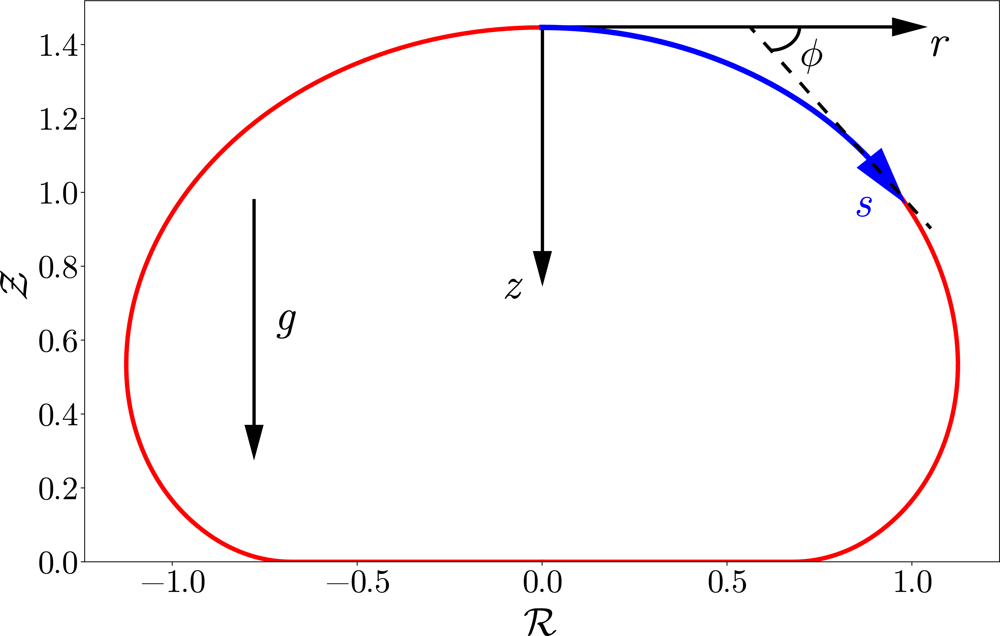
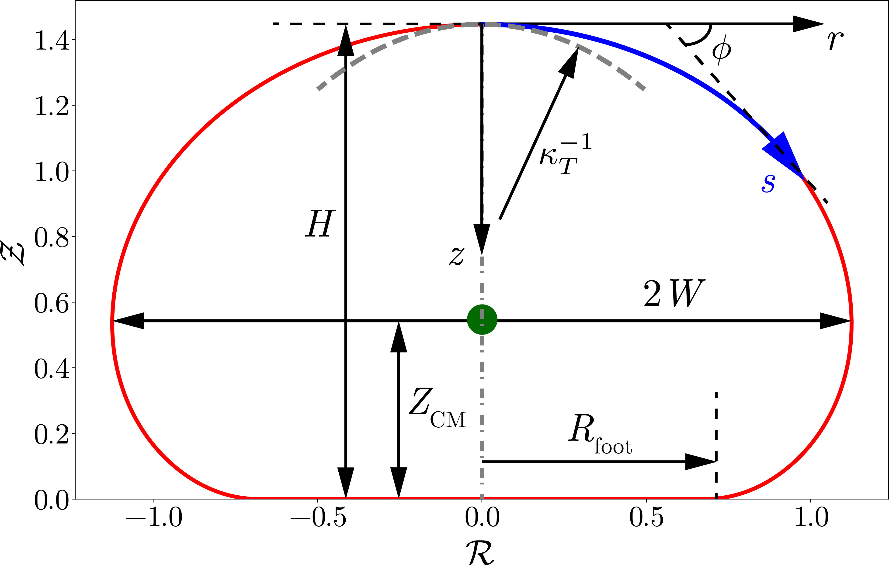

# DropsOnSurfaces
This is a repository containing the equilibrium shapes of drops sitting on superhydrophobic surfaces




Laplace equaiton for this problem gives a boundary value problem (see figure) where the two boundaries are the surface of the drop and the surface of the substrate. However, both boundaries are not known apriori. Therefore, we will solve the problem using the initial value problem (IVP) formulation.

The set of ODE that we need to solve is the following:

$$ \frac{d\phi}{ds} + \frac{\sin\phi}{r} = \kappa_T + Bo z $$

where $r-z$ is the cylindrical coordinate system as shown in the figure. We have parameterized the equation for curvature using the length of arc $s$ and the tangent angle $\phi$. See page 15-16 of [deserno2004notes](https://www.cmu.edu/biolphys/deserno/pdf/diff_geom.pdf) for more details. Consequently, two more ODEs are needed to solve the problem:

$$ \frac{dr}{ds} = \cos\phi $$
$$ \frac{dz}{ds} = \sin\phi $$

### Initial conditions

$$ \phi(s = 0) = 0 $$
$$ r(s = 0) = 0 $$ 

**Note:** Need to initialize with a very small (finite) valuen of $r(s = 0)$ to avoid division by zero.

$$ z(s = 0) = 0 $$

### References
``` bib
@misc{deserno2004notes,
  title={Notes on differential geometry},
  author={Deserno, M.},
  year={2004},
  publisher={Dover, New York. https://www.cmu.edu/biolphys/deserno/pdf/diff_geom.pdf}
}
```

*Note* Initial guess of $\kappa_T$: The initial guess for the curvature at the apex of the drop is taken from the database: [NormalizeBond.csv](NormalizeBond.csv). If such a file is absent, $\kappa_T = 2$ is taken as the initial guess. 

# Analyze results

There are several metrics:

* Curvature at the top of the drop: $\kappa_T$
* Height of the drop: $H$
* Center of mass location of the drop $Z_{CM}$. Also compute the center of mass sag: $\delta$: it can be computed as $1-Z_{CM}/R_0$ or $2-H/R_0$
* Width of the drop: $W$ (note that in the file NormalizeBond/NormalizeBond.csv, half of the width is stored)
* Footprint of the drop: $R_{foot}$
* Taylor Deformation: $D_T$
* Perimeter of the drop: $P$
* Area of the drop: $A$




### Word of caution

Sometimes it is useful to normalize everything with the gravito-capillary length. 

Consequently, following conversions are also important:

$$ \kappa_TR_0 = \tilde{\kappa_T}\sqrt{Bo} $$

$$ L_i/R_0 = \tilde{L_i}/\sqrt{Bo} $$

where $L_i$ are the different length scale metrics.